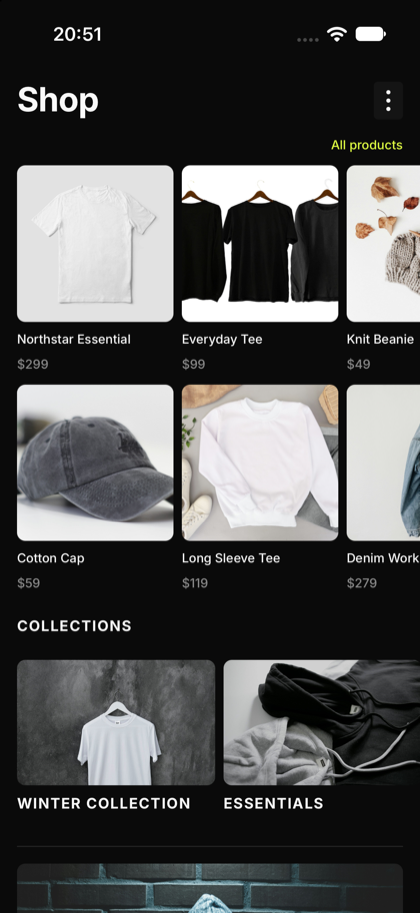
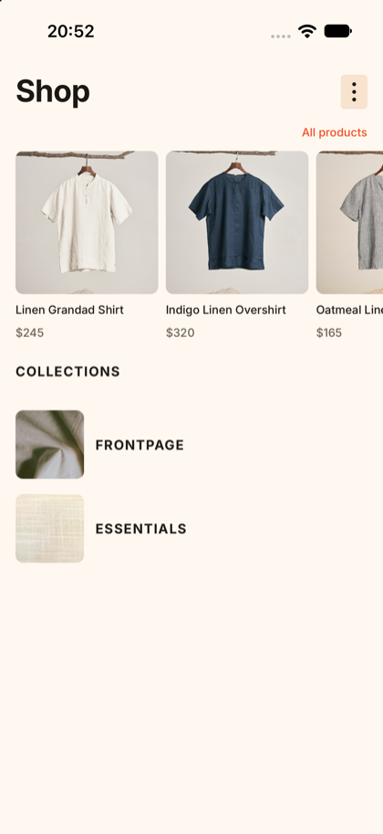
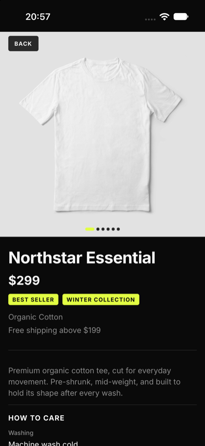
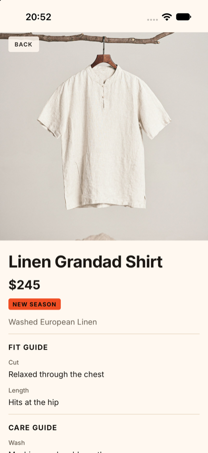
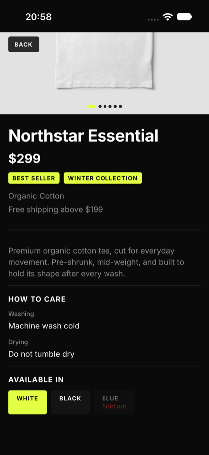
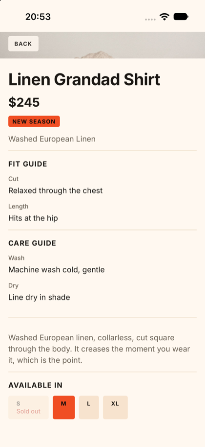
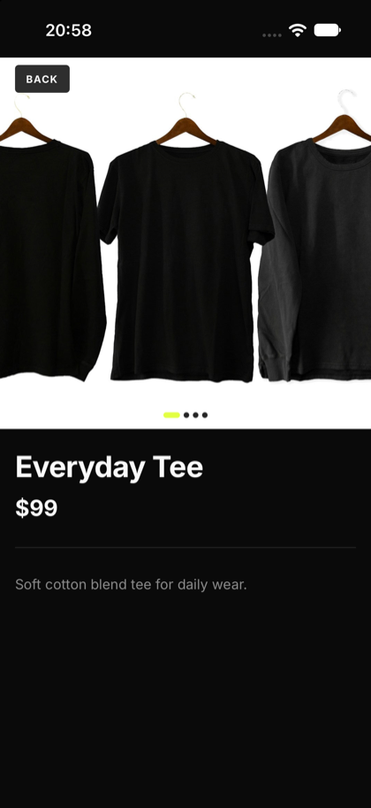
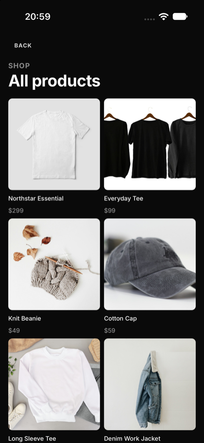
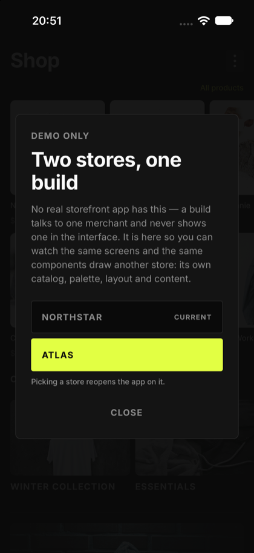

# Fuego — Shopify Storefront POC

A React Native app that renders a live Shopify store, where everything specific to one merchant —
a badge, a fabric, a promotion line, a care guide, the brand colours, even how each screen is
arranged — is **not** in the app. It lives in Shopify as metafields and in that merchant's config
entry. The merchant edits their store, the app shows whatever is there, and nothing is deployed
when a merchant changes their mind.


## The same build, two stores

Both columns below are the **same binary**, taken on the same simulator minutes apart. The only
thing that changed between them is which merchant the app resolves — one config file. No screen,
component, query or adapter is aware that either store exists.

The build ships with both, and you can switch between them on the device —
[see below](#switching-stores-on-the-device).

| | `northstar` | `atlas` |
|---|---|---|
| **Home** |  |  |
| **Product detail** |  |  |
| **Further down the same screen** |  |  |

What actually differs, and where it is declared:

| | `northstar` | `atlas` | Declared in |
|---|---|---|---|
| Palette | near-black base, lime accent | cream and clay, `#F04E23` accent | `theme` |
| Featured products | two stacked scrolling rows | one scrolling row | `layout.featured` |
| Collections | a scrolling row of tiles | stacked wide rows | `layout.collections` |
| Badges | `BEST SELLER` + a boolean flag rendered as `WINTER COLLECTION` | `NEW SEASON` only | `screens.productDetail.badgeRow` |
| Line under the price | `Organic Cotton` (`custom.material`) | `Washed European Linen` (`custom.fabric_type`) | `screens.productDetail.underPrice` |
| Sections | `HOW TO CARE`, **below** the description | `FIT GUIDE` and `CARE GUIDE`, **above** it | which area key holds them |
| Home footer | brand story, from a metaobject | nothing — the key is absent | `screens.home.footer` |

Two different vocabularies, two palettes, two arrangements, two sets of sections in two different
places on the screen — and the diff between them is one file each under
`src/config/merchant/merchants/`. That is the whole claim of this POC, and
[One app, many merchants](#one-app-many-merchants) is how it is held up.

And when a merchant fills in nothing, nothing renders — no placeholder, no `Material: —`, no empty
heading. The sections do not exist:

| A product with no metafields at all | The catalogue grid |
|---|---|
|  |  |

### Switching stores on the device

The control on the Home title row opens this, and it says what it is before it offers anything: no
real storefront app has a store switch — a build talks to one merchant, and the merchant never
shows up in the interface. It is here so the table above can be checked on the device instead of
taken on trust.



Picking the other store reopens the app on it: the theme is rebuilt from that merchant's palette,
the query cache is dropped and the navigation stack is remounted, so nothing from the previous
store survives — including the status bar, whose glyphs follow the new background. The choice is
not persisted: a cold start comes back on the merchant declared in
`src/config/merchant/activeMerchant.ts`.

The cost of that convenience is contained to one place in the production path: the GraphQL document
is a template literal built once at import, so it asks for **every declared merchant's** metafield
identifiers rather than only the active one's. The adapter indexes the response by identifier and
resolves only the blocks the active merchant declared, so identifiers a product does not define
come back `null` and are dropped. The ceiling is Shopify's 250 identifiers per query.

---

## Technologies

Everything here is in `package.json`; nothing is listed that the project does not use.

| | Why it is here |
|---|---|
| **React Native 0.87 (CLI)** | Bare CLI, not Expo. Nothing in the project needs the managed workflow, and the CLI keeps the native projects open for the Shopify SDKs a real deployment would reach for. |
| **TypeScript** | The Storefront payload and the domain model are separate types on purpose; the compiler is what keeps a raw Shopify shape from leaking into a screen — and what rejects a merchant declaring a layout or a block the renderer cannot draw. |
| **React Navigation** (native stack) | Three screens, one stack. Params are typed in `src/routes/types/navigationTypes.ts`. |
| **TanStack Query v5** | Owns every bit of server state: cache, retry, loading and error flags. There is no second state library, and no Redux. |
| **@shopify/restyle** | Themed primitives (`Box`, `Text`, `PressableBox`, `AnimatedBox`) whose props only accept tokens from `src/theme`. A raw hex in a component does not compile. |
| **react-native-reanimated 4** (+ `react-native-worklets`) | Press feedback and list entrances. Worklets is a separate peer on RN 0.87, and its Babel plugin must stay last in `babel.config.js`. |
| **lottie-react-native** | The loading animation on the product detail, repainted at runtime in the active merchant's accent. |
| **react-native-safe-area-context** / **react-native-screens** | Insets for the `Screen` container and the native stack. |
| **react-native-config** | Reads the API version and each merchant's domain + Storefront token from `.env`, so no credential is ever in a tracked file. |
| **Shopify Storefront API + GraphQL** | Buyer-facing and read-only, so its token is safe on a device. One query shapes a whole screen. Called with the platform's own `fetch` — no HTTP client was added for four requests. |

**There is no test layer, and that is deliberate.** Installing Jest and RTL to assert that an
adapter maps five fields would have cost more than the mapping; the thing actually worth checking
here is whether a real Shopify response renders, which a unit test cannot tell you. Verification
is the simulator against the live store. For anything beyond a POC this is the first gap to close.

**Lint is the gate.** `yarn lint` carries the logic rules, the quote style and the import order;
Prettier handles formatting alone, on save. `.husky/pre-commit` runs the lint and `.husky/pre-push`
runs `tsc --noEmit` plus a local secret/SAST scan (gitleaks + semgrep) and a dependency audit, so
none of them can be skipped by accident. The audit blocks on a high/critical advisory that has a
published patch and only warns on one that does not — a gate nobody can satisfy is a gate everyone
bypasses.

---

## Requirements

| | |
|---|---|
| Node | `>= 22.11.0` |
| Yarn | 1.x |
| Xcode | 16+, with an iOS simulator installed |
| Ruby + Bundler | for CocoaPods. The `Gemfile` is committed and `yarn pods` runs `bundle install` for you — you only need Ruby and the `bundler` gem on PATH |
| Android Studio | only to build Android yourself — installing the prebuilt [`dist/fuego-v1.0.apk`](dist/fuego-v1.0.apk) needs nothing but a device |

You also need a Shopify store you can administer — see [Shopify setup](#shopify-setup).

---

## How to run

**On Android you do not have to build anything.** A prebuilt release ships with the repo at
[`dist/fuego-v1.0.apk`](dist/fuego-v1.0.apk) (74 MB, universal: arm64, armv7, x86, x86_64) and holds
both demo stores in one app — see [Installing the APK](#installing-the-apk). iOS has no hosted
build; it runs from source on a simulator.

```bash
git clone <this-repo>
cd POC
yarn
yarn pods           # bundle install + pod install, iOS only
cp .env.example .env   # then fill it in — see below
yarn ios            # or: yarn android
```

`.env` holds the API version plus one domain/token pair per merchant, prefixed with that
merchant's id, and no defaults:

```sh
SHOPIFY_API_VERSION=2026-01   # pinned; an unpinned endpoint changes shape under you

NORTHSTAR_STORE_DOMAIN=your-store.myshopify.com
NORTHSTAR_STOREFRONT_TOKEN=   # public Storefront access token

ATLAS_STORE_DOMAIN=
ATLAS_STOREFRONT_TOKEN=
```

Only the merchant the app is currently on is validated, so you can run it holding one store's
credentials — it boots on the one in `src/config/merchant/activeMerchant.ts`. If a key that
merchant needs is missing, the app throws naming the key, rather than failing later with an
unhelpful network error, and the demo switch refuses a store whose keys are absent instead of
reopening on a dead app.

> `react-native-config` reads `.env` at **build** time. Change it and you have to rebuild —
> reloading the bundle is not enough.

### Shopify setup

1. **Headless channel** — install it on the store, create a storefront, and copy the **public
   access token**. This is not an Admin API token; an Admin token must never reach the device.
2. **Scopes** — the public token needs `unauthenticated_read_product_listings` (this covers
   collections too) and `unauthenticated_read_metaobjects` for the brand story block.
3. **Metafield definitions** — under *Settings → Custom data → Products*. Which ones you create
   depends on the merchant, because the keys come from the blocks that merchant declares:

   | Namespace / key | Type | Used by |
   |---|---|---|
   | `custom.badge` | single line text | both |
   | `custom.promotion_text` | single line text | both |
   | `custom.material` | single line text | northstar |
   | `custom.is_winter_collection` | boolean | northstar |
   | `custom.care_instructions` | JSON (`{"washing": "...", "drying": "..."}`) | both |
   | `custom.fabric_type` | single line text | atlas |
   | `custom.fit_guide` | JSON (`{"cut": "...", "length": "..."}`) | atlas |

4. **⚠️ Turn on Storefront access for every definition.** Each definition has a *Storefront
   access* toggle, and it is **off** by default. A definition that is correct in every other way
   but not exposed returns `null` to a correct query, so the app renders nothing and looks like
   it is ignoring your data. This is the single most common reason the app looks "empty" —
   check it before debugging anything in the code.
5. **Metaobject** — a `brand_story` metaobject with `title`, `description` and `image` fields,
   also exposed to the Storefront API. It feeds the block at the bottom of the home screen, and
   only for a merchant that declares a `story` block (northstar does, atlas does not).
6. **Publish** your products to the headless storefront's publication, or they will not be
   returned at all.

There is a seeding script for a throwaway dev store:

```bash
set -a; . ./.env; . ~/.config/northstar-poc/admin-token.sh; set +a
node scripts/seed-catalog.mjs northstar     # or: atlas
```

It uses the **Admin** API, is dev-only tooling that nothing under `src/` imports, reads its token
from the environment (never from `.env` or any tracked file), and only ever creates or updates —
it never deletes. Each merchant has its own catalogue module (`scripts/catalog.mjs`,
`scripts/catalog-atlas.mjs`) with its own garments, photography and metafield coverage; coverage is
uneven on purpose, so the "merchant filled nothing in" case exists on a real product.

### Installing the APK

A prebuilt release ships with the repo: [`dist/fuego-v1.0.apk`](dist/fuego-v1.0.apk). It is signed
with React Native's stock debug keystore, so the phone will ask you to allow an install from an
unknown source.

```bash
adb install dist/fuego-v1.0.apk     # or copy it to the device and tap the file
```

To rebuild it:

```bash
cd android && ./gradlew assembleRelease
cp app/build/outputs/apk/release/app-release.apk ../dist/fuego-v1.0.apk
```

`react-native-config` reads `.env` at build time, so the APK you build carries *your* Storefront
credentials, and the one committed here carries the demo stores'. Both merchants are inside a single
build — the overflow menu switches between them at runtime.

Honest caveat: the UI work was exercised on the iOS simulator. The Android side is the stock React
Native scaffold; this release APK was installed and launched on an Android emulator and renders the
live catalogue, but no screen was tuned for it.

---

## Project structure

```
src/
├── api/shopify/        the transport, and the only place that knows Shopify exists
│   ├── client.ts         fetch + Storefront headers + pinned API version
│   ├── fragments.ts      shared GraphQL selections, built from the merchant's blocks
│   └── shopifyTypes.ts   raw payload shapes (MoneyV2, edges/nodes, metafields)
├── domain/             one folder per concept: Product, Collection, BrandStory
│   └── Product/
│       ├── productQueries.ts   the GraphQL documents
│       ├── productApi.ts       runs a document, returns the raw payload
│       ├── productService.ts   delegates
│       ├── productAdapter.ts   payload → domain model; resolves the merchant's blocks
│       ├── productTypes.ts     Product, ProductVariant, ProductContent, ResolvedBlock
│       ├── useCases/           use{Domain}{Action}{Target} — the React Query entry point
│       └── index.ts            exports useCases + types, never the service
├── config/merchant/    one file per merchant: credentials, palette, layout, screen areas
├── components/         generic and presentational
│   ├── Screen/           every screen's container: safe area, background, gutter, back, title
│   ├── Box, Text, PressableBox   restyle primitives (PressableBox owns press feedback)
│   ├── ContentBlocks/    renders one resolved area — the bridge from config to UI
│   ├── ProductCard, ProductBadge, ProductSection, CollectionCard, StoryCard
│   └── ProductGallery/   paged run through a product's photos
├── screens/            Home, ProductList, ProductDetail (+ screen-local components)
├── routes/             one native stack, typed params
├── theme/              palette, tokens, text variants, fonts, motion, contrast, lottie tint
├── assets/             Inter faces + the Lottie loading document
├── infra/              query client, QueryKeys enum
└── utils/              pure helpers (price formatting, …)
```

Every module is reached through its alias barrel (`@components`, `@domain`, `@config`, `@theme`,
`@assets`, …), declared once in `tsconfig.json` and `babel.config.js`. There is no deep relative
import across modules.

Data flows one way:

```
Shopify Storefront API
  → client.ts            headers, API version, throws on the `errors` array (a 200 is not success)
  → {domain}Queries.ts   the GraphQL document
  → {domain}Api.ts       raw payload, untransformed
  → {domain}Adapter.ts   → domain model. Every bit of parsing happens here and nowhere else
  → useCase hook         React Query: cache, loading, error
  → screen               renders a domain model, and has never heard of Shopify
```

What each layer may not do:

| Layer | Must not |
|---|---|
| Screen / component | Contain business logic, call a service, or touch a Storefront-shaped type |
| UseCase hook | Reach past the service into the api |
| Service | Know that React exists |
| Api | Transform anything |
| Adapter | Make a network call |

The boundary is structural, not a convention: `domain/{Domain}/index.ts` exports **use cases and
types only**. The service is not reachable from `@domain`, so a screen calling it directly does
not compile.

**Where new things go.** A screen → `src/screens/{Name}Screen/`. A component shared across flows
→ `src/components/{Name}/`; used by one screen → that screen's `components/`. A new piece of
merchant content → **one entry in the area that draws it, and nothing else**. Needing to touch a
type, the adapter, a query or a screen means the *kind* of block is missing, and a new kind is a
platform change, not a merchant one.

---

## Key features

**Product browsing.** Home with featured products, collections and the brand story; a product grid
for the whole catalogue or one collection; and a detail screen with photos, price, description,
variants and availability. Sold-out variants are visible but not selectable, and picking a variant
that has its own photo moves the image (or pages the gallery) to it.

**Merchant content through metafields.** Metafields are not returned by default, so they are
requested explicitly by identifier — and the identifier list in the GraphQL fragment is *built from
the declared merchants' blocks*, deduplicated, at module load (every merchant's, because the
document is a template literal built once and the demo switch changes stores afterwards). Shopify answers with a **positional
array containing `null` for every identifier the product does not define**, so the adapter indexes
by `namespace:key` and reads by block, because indexing that array by position breaks on the first
bare product. A merchant-authored JSON metafield is parsed in a `try/catch` and a non-object
degrades to absent: store content is untrusted input.

**Absent renders nothing.** A block whose metafield is missing, empty or `false` produces no
resolved block; an area that collected nothing is left out of `content`; and every component returns
`null` on a missing value. No `undefined`, no dash, no empty heading, no reserved space.

**Generic components, always.** A merchant requirement becomes a generic component plus a config
entry — `<ProductBadge text={...} />` and `<ProductSection title={...} items={...} />`, never a
`<NorthstarWinterBadge />`. Merchant identity *and vocabulary* exist only inside
`src/config/merchant/`: the "Winter Collection" badge is a boolean block whose label is in the
config, and the care guide is the same `labelValueSection` kind that renders "Fit guide" for the
other store and would render "Ingredients" for a cosmetics merchant with no code change.

---

## One app, many merchants

The app owns the grammar; the merchant owns the words. Variation lives in exactly four axes, all of
them in that merchant's file under `src/config/merchant/merchants/`, and switching merchants is
which config entry the app resolves — nothing else moves.

Because the axes are closed, onboarding a store is an intake form rather than a discovery project:
**[docs/merchant-onboarding-form.md](docs/merchant-onboarding-form.md)** asks a new company for
everything the four axes need — credentials, brand colours, arrangement and where each piece of
content lives in their Shopify. Filled in and returned, those answers are enough to run their store
in this build, with no new screen, component or query written.

### 1. Credentials

Store domain, Storefront token and API version, read from `.env` by key name. Only the active
merchant's keys are validated, so one developer never needs another store's token.

### 2. Brand palette

A merchant overrides values, never the token list; an omitted token falls back to the base
near-black identity.

| Token | Overridable |
|---|---|
| `background`, `surface`, `text`, `textMuted`, `border`, `accent` | yes |
| `accentText` | no — derived from the accent's luminance |
| `success` / `danger` | no — picked from the **background's** luminance |

Derived tokens are not configurable because a configured one can be invisible: a mint "in stock"
tuned for near-black reads 1.68:1 on cream. Theme construction **throws in `__DEV__`** when a
merchant palette falls below 4.5:1 for copy or 3:1 for a state colour, naming the pair and the
measured ratio. A palette fails by being unreadable, so it is measured rather than eyeballed.

### 3. Layout

A merchant picks how each section is arranged, from a closed set the app already knows how to draw.
The values are a **union in the source**, so a merchant cannot express an arrangement the renderer
cannot draw — the compiler rejects it. An omitted key is the base arrangement.

| Section | Values | Base |
|---|---|---|
| `featured` | `single` — one scrolling row · `double` — two stacked rows, the same products split | `single` |
| `collections` | `inline` — stacked wide rows · `horizontal` — one scrolling row of tiles | `inline` |
| `detail` | `single` — one cover photo · `gallery` — a paged run through every photo | `single` |

Three rules make this hold up:

- A component that gains a shape gains a **named variant** (`CollectionCard` `row` | `tile`), never
  a layout object at the call site.
- `double` splits the products it already has — an arrangement is never a second query.
- Two scrollers on one axis fight: the horizontal collections row renders inside the list header
  and the vertical list receives no data, instead of being nested.

A gallery also degrades honestly: it pages only where the catalogue actually has photos, and a
single-image product does not rubber-band sideways as if a second photo had failed to load.

### 4. Content blocks

A merchant's content is a map of screens, and inside each the **areas** that screen draws. An area
holds a list of blocks; each block pairs a `kind` (what to draw) with its `source` and labels. Where
it lands is the key path, and when it draws is the array index — no block carries a slot or an
order:

```ts
screens: {
  productDetail: { badgeRow: [...], underPrice: [...], belowDescription: [...] },
  home: { footer: {...} },
}
```


| Kind | Draws | Source |
|---|---|---|
| `badge` | `ProductBadge` | a text metafield, or a boolean one plus the block's own label |
| `textLine` | one muted line | a text metafield |
| `labelValueSection` | `ProductSection` — a heading and label/value rows | a JSON metafield plus the field keys to read |
| `story` | `StoryCard` on the home footer | a metaobject type plus that merchant's field keys |

Areas, in the order the detail screen stacks them: `productDetail.badgeRow` → `underPrice` →
`aboveDescription` → *(description)* → `belowDescription`; plus `home.footer` for the story. Each
area's element type is what it accepts, so a badge cannot be declared where only prose fits, and an
area a merchant leaves out renders nothing — no heading, no divider, no gap. That absence is the
whole optional/required mechanism; there is no flag.

Anything that cannot be expressed in these four axes is a platform feature, not a merchant feature:
it gets built generically, and a merchant that does not declare it simply never sees it.

### The two merchants, side by side

`northstar` is the real store this was built against; `atlas` is a second config committed to prove
every axis moves independently — the screenshots and the per-axis diff are at
[the top of this file](#the-same-build-two-stores).

Both declare `detail: "gallery"`, which is the honest half of the demonstration: northstar's
products carry six and four photos and page through them, while atlas's carry one and the same
arrangement quietly collapses to a single image. An arrangement is a request, not a promise the
catalogue has to keep.

The fabric line is the cheap one: a merchant who calls it `fabric_type` instead of `material`,
under a different heading, in a different place on the screen, costs one array entry — because the
query, the adapter and the screen are all built from that entry.

---

## Design and motion

Every colour, space, radius and duration is a token in `src/theme`; there is no raw hex and no
inline duration anywhere in the app. The identity is streetwear-flavoured: absolute contrast,
photography carrying the screen, type doing the talking, one radius scale and an empty shadow scale
(elevation is contrast, not shadow).

- **`Screen`** is the container for every screen: safe area, background, screen gutter, back
  control and title. The gutter never goes on the frame that wraps a scroller — iOS clips to that
  frame, so a row meant to bleed to the device edge dies there. Lists spread `screenGutter` into
  their `contentContainerStyle`, and a bleeding row cancels it with `marginHorizontal="sNegative16"`.
- **Press feedback lives in `PressableBox`**, which every tappable surface already routes through,
  so a product card, a variant chip and the back control dip by the same 3% — instant in, settling
  out.
- **`theme/motion.ts`** makes duration and curve tokens: cards fade up into a list at 260ms, boxes
  that change size settle in 180ms. Motion is one place for the same reason colour is: a card
  entering in 260ms next to one entering in 500ms reads as a bug, not as variety.
- **The detail screen's loading state** is a Lottie document repainted in JS with the active
  merchant's accent, rather than the native `colorFilters` prop — that one matches layers by the
  keypath the designer happened to export. Loading, empty and error states are designed with the
  identity: type and accent, never a spinner on white.

---

## How to use

1. **Home** — the featured rows, the collections, and the brand story block at the bottom, which
   comes from a Shopify metaobject rather than a metafield. On `northstar` the featured products
   come in two stacked scrolling rows and the collections scroll sideways as tiles; on `atlas` it is
   one featured row and stacked collection banners — same screen, same code.
2. Tap **All products**, or a collection, to reach the grid. Same screen in both cases; the
   collection just scopes it.
3. Tap **Northstar Essential**. This is the fully-populated case: `BEST SELLER` and
   `WINTER COLLECTION` badges, `Organic Cotton`, the promotion line, a `HOW TO CARE` section from
   a JSON metafield, three variants, and a gallery you can page through.
4. Tap **Black**, then **White** — the gallery moves to the selected variant's photo. Swiping back
   does not change the selection: the sync is one-way on purpose. **Blue** is sold out: visible,
   marked, not selectable.
5. Go back and open **Everyday Tee**. Same screen, same code, and the merchant filled in nothing:
   no badges, no material line, no care section, no variant picker. Not a dash, not an empty
   heading — the sections do not exist. That is the whole point of the metafield contract.
6. Back on Home, open the control on the title row and pick **ATLAS**. Different store, different
   palette, different arrangement, different vocabulary, different sections in different places —
   and not one line of screen or component code involved. (That switch exists for this walkthrough
   and the dialog says so: a real build ships bound to one merchant.)

---

## Out of scope

Deliberately absent, each for a reason — not a roadmap:

| | Why |
|---|---|
| Cart and checkout | Shopify's own checkout is the answer, via the Cart API and a web handoff. Reimplementing it proves nothing about merchant customisation. |
| Customer auth / OAuth app install | A real multi-merchant app installs through Shopify OAuth and keeps tokens server-side. Here, `getMerchantConfig` is a local stand-in for that platform endpoint — same shape, no server. A fetched config would also have to be *validated*, which these literals get from the compiler for free. |
| Merchant switching at runtime | The active merchant is a build-time constant, because `react-native-config` reads `.env` at build time and the theme is constructed once at module load. A real install resolves one merchant per device anyway. |
| Orders and account | Needs the authenticated Customer API, which needs the auth above. |
| Own backend / admin UI | The merchant's admin **is** the Shopify admin. That is the entire argument for metafields. |
| Push, analytics, error monitoring | Pure infrastructure; it would not change a line of the architecture. |
| Automated tests, CI/CD | See the note in [Technologies](#technologies). The first thing to add, in that order. |
| App Store / Play Store release | Nothing is shipped from a POC. |

---

## Contact

**Fernando Henrique**
[f3rnandorj10@gmail.com](mailto:f3rnandorj10@gmail.com) ·
[LinkedIn](https://www.linkedin.com/in/fernando-h-fernandes/) ·
[GitHub](https://github.com/f3rnandorj10)
